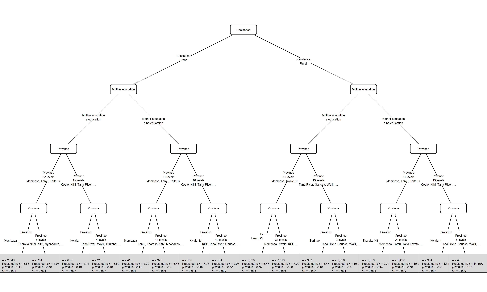
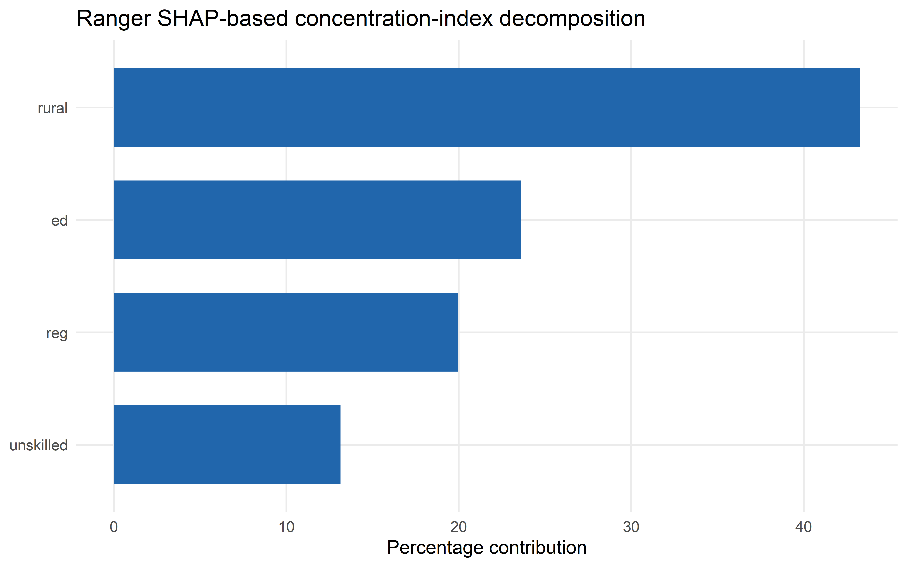

# ineqTrees

<!-- badges: start -->

[](https://github.com/m-mburu/ineqTrees/actions/workflows/R-CMD-check.yaml)

<!-- badges: end -->

`ineqTrees` provides tools for studying socioeconomic inequality in
health outcomes with tree-based models. The package includes weighted
rank and concentration-index utilities, inequality-aware split scoring,
and wrappers for fitting greedy concentration-index trees and forests.
Start with the [inequality-aware party trees
article](https://m-mburu.github.io/ineqTrees/articles/inequality-aware-party-trees.html)
for the main workflow, then see the [tuning
tutorial](https://m-mburu.github.io/ineqTrees/articles/tuning-tutorial.html)
for cross-validating trees and forests and the [plotting
tutorial](https://m-mburu.github.io/ineqTrees/articles/plotting-tutorial.html)
for customizing tree plots, node statistics, and labels.

## Installation

You can install the development version of ineqTrees like so:

``` r
remotes::install_github("m-mburu/ineqTrees")
```

## Fitting a tree

The example below fits an inequality-aware greedy tree on a sample from
the built-in `kenya` dataset. The response combines the ranking variable
(`wealth`) and the health outcome (`deadu5_num`), while the split
criterion is based on concentration-index reduction.

### load data and set seed for reproducibility

``` r
if (requireNamespace("pkgload", quietly = TRUE) && file.exists("DESCRIPTION")) {
  suppressMessages(pkgload::load_all(export_all = FALSE))
} else {
  library(ineqTrees)
}
suppressPackageStartupMessages(library(data.table))
load("data/kenya.rda")
setDT(kenya)

set.seed(1)
```

### Fit tree

This is a concentration-index tree, so the response is a two-column
matrix of the ranking variable and the outcome. The `rank_name` and
`outcome_name` arguments specify which columns of the data play those
roles. The `control` argument uses greedy tree controls from
`ci_tree_control()`, not conditional-inference test controls.

``` r
fit_tree <- ci_tree(
  formula = cbind(wealth, deadu5_num) ~ rural + ed + reg + unskilled,
  data = kenya,
  rank_name = "wealth",
  outcome_name = "deadu5_num",
  control = ci_tree_control(maxdepth = 4L)
)
```

``` r
#fit_tree
ci_tree_terminal_summary(fit_tree)
#>      node     n weight depth         ci outcome_mean outcome_percent
#>     <int> <int>  <num> <int>      <num>        <num>           <num>
#>  1:     5  1389   1389     4 0.11442285   0.01079914        1.079914
#>  2:     6   761    761     4 0.18712221   0.03285151        3.285151
#>  3:     8   116    116     4 0.00000000   0.00000000        0.000000
#>  4:     9   450    450     4 0.15515152   0.04888889        4.888889
#>  5:    12  1030   1030     4 0.16716162   0.03300971        3.300971
#>  6:    13   553    553     4 0.15933293   0.06509946        6.509946
#>  7:    15   314    314     4 0.11407064   0.07006369        7.006369
#>  8:    16   153    153     4 0.20915033   0.16339869       16.339869
#>  9:    20  4281   4281     4 0.27934367   0.04321420        4.321420
#> 10:    21  5564   5564     4 0.17038490   0.07494608        7.494608
#> 11:    23  1082   1082     4 0.06781155   0.07948244        7.948244
#> 12:    24  1661   1661     4 0.10499804   0.13786875       13.786875
#> 13:    27   420    420     4 0.08015873   0.09285714        9.285714
#> 14:    28  1244   1244     4 0.10026665   0.13183280       13.183280
#> 15:    30   568    568     4 0.20699773   0.15316901       15.316901
#> 16:    31   457    457     4 0.11676726   0.19912473       19.912473
#>                                                                                                                                                                                                                                                                                                                                                                                                                                                                                                                                                                                                                rule
#>                                                                                                                                                                                                                                                                                                                                                                                                                                                                                                                                                                                                              <char>
#>  1:                                                                                                                                                                                           rural in {Urban} & reg in {Mombasa, Taita Taveta, Isiolo, Meru, Makueni, Nyeri, Kirinyaga, Kiambu, Trans Nzoia, Uasin Gishu, Nandi, Laikipia, Nakuru, Kajiado, Kericho, Bomet, Kakamega, Vihiga, Busia, Homa Bay, Migori, Kisii, Nairobi} & ed in {a education} & reg in {Mombasa, Taita Taveta, Meru, Kirinyaga, Kiambu, Trans Nzoia, Uasin Gishu, Nandi, Laikipia, Kajiado, Kericho, Bomet, Vihiga, Kisii, Nairobi}
#>  2:                                                                                                                                                                                                                                                                    rural in {Urban} & reg in {Mombasa, Taita Taveta, Isiolo, Meru, Makueni, Nyeri, Kirinyaga, Kiambu, Trans Nzoia, Uasin Gishu, Nandi, Laikipia, Nakuru, Kajiado, Kericho, Bomet, Kakamega, Vihiga, Busia, Homa Bay, Migori, Kisii, Nairobi} & ed in {a education} & reg in {Isiolo, Makueni, Nyeri, Nakuru, Kakamega, Busia, Homa Bay, Migori}
#>  3:                                                                                                                                                                                                                                                            rural in {Urban} & reg in {Mombasa, Taita Taveta, Isiolo, Meru, Makueni, Nyeri, Kirinyaga, Kiambu, Trans Nzoia, Uasin Gishu, Nandi, Laikipia, Nakuru, Kajiado, Kericho, Bomet, Kakamega, Vihiga, Busia, Homa Bay, Migori, Kisii, Nairobi} & ed in {b no education} & reg in {Isiolo, Makueni, Nyeri, Kirinyaga, Uasin Gishu, Kajiado, Bomet, Vihiga}
#>  4:                                                                                                                                                                                             rural in {Urban} & reg in {Mombasa, Taita Taveta, Isiolo, Meru, Makueni, Nyeri, Kirinyaga, Kiambu, Trans Nzoia, Uasin Gishu, Nandi, Laikipia, Nakuru, Kajiado, Kericho, Bomet, Kakamega, Vihiga, Busia, Homa Bay, Migori, Kisii, Nairobi} & ed in {b no education} & reg in {Mombasa, Taita Taveta, Meru, Kiambu, Trans Nzoia, Nandi, Laikipia, Nakuru, Kericho, Kakamega, Busia, Homa Bay, Migori, Kisii, Nairobi}
#>  5:                                                                                                                                                                                   rural in {Urban} & reg in {Kwale, Kilifi, Tana River, Lamu, Garissa, Wajir, Mandera, Marsabit, Tharaka-Nithi, Embu, Kitui, Machakos, Nyandarua, Murang'a, Turkana, West Pokot, Samburu, Elgeyo-Marakwet, Baringo, Narok, Bungoma, Siaya, Kisumu, Nyamira} & ed in {a education} & reg in {Lamu, Garissa, Marsabit, Tharaka-Nithi, Kitui, Machakos, Nyandarua, Murang'a, West Pokot, Baringo, Narok, Bungoma, Kisumu, Nyamira}
#>  6:                                                                                                                                                                                                                            rural in {Urban} & reg in {Kwale, Kilifi, Tana River, Lamu, Garissa, Wajir, Mandera, Marsabit, Tharaka-Nithi, Embu, Kitui, Machakos, Nyandarua, Murang'a, Turkana, West Pokot, Samburu, Elgeyo-Marakwet, Baringo, Narok, Bungoma, Siaya, Kisumu, Nyamira} & ed in {a education} & reg in {Kwale, Kilifi, Tana River, Wajir, Mandera, Embu, Turkana, Samburu, Elgeyo-Marakwet, Siaya}
#>  7:                                                                                                                                                                 rural in {Urban} & reg in {Kwale, Kilifi, Tana River, Lamu, Garissa, Wajir, Mandera, Marsabit, Tharaka-Nithi, Embu, Kitui, Machakos, Nyandarua, Murang'a, Turkana, West Pokot, Samburu, Elgeyo-Marakwet, Baringo, Narok, Bungoma, Siaya, Kisumu, Nyamira} & ed in {b no education} & reg in {Kwale, Kilifi, Tana River, Mandera, Tharaka-Nithi, Embu, Machakos, Nyandarua, Murang'a, Elgeyo-Marakwet, Baringo, Bungoma, Siaya, Kisumu, Nyamira}
#>  8:                                                                                                                                                                                                                                        rural in {Urban} & reg in {Kwale, Kilifi, Tana River, Lamu, Garissa, Wajir, Mandera, Marsabit, Tharaka-Nithi, Embu, Kitui, Machakos, Nyandarua, Murang'a, Turkana, West Pokot, Samburu, Elgeyo-Marakwet, Baringo, Narok, Bungoma, Siaya, Kisumu, Nyamira} & ed in {b no education} & reg in {Lamu, Garissa, Wajir, Marsabit, Kitui, Turkana, West Pokot, Samburu, Narok}
#>  9:                                                                             rural in {Rural} & reg in {Mombasa, Kwale, Kilifi, Lamu, Taita Taveta, Isiolo, Meru, Tharaka-Nithi, Embu, Kitui, Machakos, Makueni, Nyandarua, Nyeri, Kirinyaga, Murang'a, Kiambu, Trans Nzoia, Uasin Gishu, Elgeyo-Marakwet, Nandi, Baringo, Laikipia, Nakuru, Narok, Kajiado, Kericho, Bomet, Kakamega, Vihiga, Bungoma, Busia, Kisumu, Kisii, Nyamira, Nairobi} & ed in {a education} & reg in {Mombasa, Kwale, Lamu, Machakos, Nyeri, Kirinyaga, Kiambu, Trans Nzoia, Elgeyo-Marakwet, Nandi, Nakuru, Vihiga, Nyamira, Nairobi}
#> 10:       rural in {Rural} & reg in {Mombasa, Kwale, Kilifi, Lamu, Taita Taveta, Isiolo, Meru, Tharaka-Nithi, Embu, Kitui, Machakos, Makueni, Nyandarua, Nyeri, Kirinyaga, Murang'a, Kiambu, Trans Nzoia, Uasin Gishu, Elgeyo-Marakwet, Nandi, Baringo, Laikipia, Nakuru, Narok, Kajiado, Kericho, Bomet, Kakamega, Vihiga, Bungoma, Busia, Kisumu, Kisii, Nyamira, Nairobi} & ed in {a education} & reg in {Kilifi, Taita Taveta, Isiolo, Meru, Tharaka-Nithi, Embu, Kitui, Makueni, Nyandarua, Murang'a, Uasin Gishu, Baringo, Laikipia, Narok, Kajiado, Kericho, Bomet, Kakamega, Bungoma, Busia, Kisumu, Kisii}
#> 11:                                                                             rural in {Rural} & reg in {Mombasa, Kwale, Kilifi, Lamu, Taita Taveta, Isiolo, Meru, Tharaka-Nithi, Embu, Kitui, Machakos, Makueni, Nyandarua, Nyeri, Kirinyaga, Murang'a, Kiambu, Trans Nzoia, Uasin Gishu, Elgeyo-Marakwet, Nandi, Baringo, Laikipia, Nakuru, Narok, Kajiado, Kericho, Bomet, Kakamega, Vihiga, Bungoma, Busia, Kisumu, Kisii, Nyamira, Nairobi} & ed in {b no education} & reg in {Mombasa, Tharaka-Nithi, Nyandarua, Nyeri, Kirinyaga, Murang'a, Kiambu, Nandi, Laikipia, Narok, Bomet, Vihiga, Busia, Nairobi}
#> 12: rural in {Rural} & reg in {Mombasa, Kwale, Kilifi, Lamu, Taita Taveta, Isiolo, Meru, Tharaka-Nithi, Embu, Kitui, Machakos, Makueni, Nyandarua, Nyeri, Kirinyaga, Murang'a, Kiambu, Trans Nzoia, Uasin Gishu, Elgeyo-Marakwet, Nandi, Baringo, Laikipia, Nakuru, Narok, Kajiado, Kericho, Bomet, Kakamega, Vihiga, Bungoma, Busia, Kisumu, Kisii, Nyamira, Nairobi} & ed in {b no education} & reg in {Kwale, Kilifi, Lamu, Taita Taveta, Isiolo, Meru, Embu, Kitui, Machakos, Makueni, Trans Nzoia, Uasin Gishu, Elgeyo-Marakwet, Baringo, Nakuru, Kajiado, Kericho, Kakamega, Bungoma, Kisumu, Kisii, Nyamira}
#> 13:                                                                                                                                                                                                                                                                                                                                                                                                                                   rural in {Rural} & reg in {Tana River, Garissa, Wajir, Mandera, Marsabit, Turkana, West Pokot, Samburu, Siaya, Homa Bay, Migori} & unskilled in {No} & reg in {Siaya, Migori}
#> 14:                                                                                                                                                                                                                                                                                                                                                           rural in {Rural} & reg in {Tana River, Garissa, Wajir, Mandera, Marsabit, Turkana, West Pokot, Samburu, Siaya, Homa Bay, Migori} & unskilled in {No} & reg in {Tana River, Garissa, Wajir, Mandera, Marsabit, Turkana, West Pokot, Samburu, Homa Bay}
#> 15:                                                                                                                                                                                                                                                                                                                                                                                                                                     rural in {Rural} & reg in {Tana River, Garissa, Wajir, Mandera, Marsabit, Turkana, West Pokot, Samburu, Siaya, Homa Bay, Migori} & unskilled in {Yes} & ed in {a education}
#> 16:                                                                                                                                                                                                                                                                                                                                                                                                                                  rural in {Rural} & reg in {Tana River, Garissa, Wajir, Mandera, Marsabit, Turkana, West Pokot, Samburu, Siaya, Homa Bay, Migori} & unskilled in {Yes} & ed in {b no education}
```

``` r
readme_tree_plot(fit_tree, kenya, "deadu5_num")
```


## Fitting a forest

The forest interface uses the same response specification, but averages
predictions across many greedy concentration-index trees. The tuned
workflow later in the README uses the same model family with
cross-validation.

``` r
fit_forest <- ci_forest(
  formula = cbind(wealth, deadu5_num) ~ rural + ed + reg + unskilled,
  data = kenya,
  rank_name = "wealth",
  outcome_name = "deadu5_num",
  ntree = 10L,
  mtry = 1L,
  control = ci_tree_control(maxdepth = 5L)
)
fit_forest
```

### Greedy concentration-index forest

**Formula:** `cbind(wealth, deadu5_num) ~ rural + ed + reg + unskilled`
**Criterion:** CI **Trees:** 10

| ntree | mtry | type | n | mean_outcome | mean_prediction | outcome_ci | prediction_ci | mean_terminal_nodes | mean_max_depth |
|---:|---:|:---|---:|---:|---:|---:|---:|---:|---:|
| 10 | 1 | CI | 20043 | 0.074 | 0.074 | 0.311 | 0.108 | 6.8 | 3.5 |

Forest summary

``` r
ci_forest_summary(fit_forest)
#>    ntree  mtry   type     n mean_outcome mean_prediction outcome_ci
#>    <int> <int> <char> <int>        <num>           <num>      <num>
#> 1:    10     1     CI 20043   0.07369156       0.0736521  0.3114896
#>    prediction_ci mean_terminal_nodes mean_max_depth
#>            <num>               <num>          <num>
#> 1:     0.1079911                 6.8            3.5
```

### Parallel execution patterns

`ineqTrees` uses the `future` ecosystem for optional parallel work and
never sets the future plan inside model functions. Choose one layer at a
time: direct forest fitting, custom tuning tasks, or tidymodels
resamples.

``` r
old_plan <- future::plan()
future::plan(future::multisession, workers = 2)
on.exit(future::plan(old_plan), add = TRUE)

fit_forest <- ci_forest(
  formula = cbind(wealth, deadu5_num) ~ rural + ed + reg + unskilled,
  data = kenya,
  rank_name = "wealth",
  outcome_name = "deadu5_num",
  ntree = 50L,
  parallel = TRUE
)
```

``` r
old_plan <- future::plan()
future::plan(future::multisession, workers = 2)
on.exit(future::plan(old_plan), add = TRUE)

forest_tune_grid <- ci_tree_control_grid(
  minsplit = 100L,
  minbucket = c(50L, 100L),
  maxdepth = 3:4,
  mtry = c(1L, 2L),
  ntree = c(10L, 50L)
)

forest_tuning <- tune_ci_forest(
  formula = cbind(wealth, deadu5_num) ~ rural + ed + reg + unskilled,
  data = kenya,
  rank_name = "wealth",
  outcome_name = "deadu5_num",
  control_grid = forest_tune_grid,
  v = 5L,
  parallel_over = "tuning"
)
```

``` r
old_plan <- future::plan()
future::plan(future::multisession, workers = 2)
on.exit(future::plan(old_plan), add = TRUE)

forest_tuned <- tune::tune_grid(
  forest_wf,
  resamples = tree_folds,
  grid = forest_grid,
  metrics = yardstick::metric_set(ci_gain_tuning, yardstick::rmse),
  control = tune::control_grid(parallel_over = "resamples")
)
```

### Fit a surrogate tree to forest predictions

The surrogate is a greedy concentration-index tree that approximates the
predictions of the fitted forest. `ci_forest_surrogate()` adds the
forest predictions to the analysis data and fits the surrogate with the
same rank and predictor variables.

``` r
forest_surrogate <- ci_forest_surrogate(
  fit_forest,
  data = kenya,
  formula = cbind(wealth, deadu5_num) ~ rural + ed + reg + unskilled,
  rank_name = "wealth",
  prediction_name = "forest_risk",
  control = ci_tree_control(maxdepth = 4L)
)

surrogate_tree <- forest_surrogate$fit
surrogate_data <- forest_surrogate$data
#surrogate_tree
```

## plot

``` r
readme_tree_plot(
  surrogate_tree,
  surrogate_data,
  outcome_name = "forest_risk",
  outcome_label = "Predicted risk"
)
```



## SHAP-based decomposition

Approximate SHAP values with `fastshap::explain()`, using a prediction
wrapper that returns the predicted outcome for each observation, then
decompose the concentration index of those predicted risks with
`shap_conc_decomp()`. See the [SHAP-based decomposition
article](https://m-mburu.github.io/ineqTrees/articles/shapley-decomposition.html)
for the full walkthrough across `ci_tree()`, `ci_forest()`,
tidymodels-backed forests, and ordinary `ranger` models.

The model does not have to be an `ineqTrees` forest.
`shap_conc_decomp()` only needs three things: SHAP values, the
socioeconomic ranking variable, and the model’s predicted risk. That
means the same step also works after fitting an ordinary prediction
model, for example a `ranger` random forest tuned with tidymodels for
risk of under-five death.

``` r
library(tidymodels)
library(ranger)

ranger_data <- as.data.frame(
  kenya[, c("wealth", "deadu5_num", readme_predictors), with = FALSE]
)
ranger_data$deadu5 <- factor(
  ifelse(ranger_data$deadu5_num == 1, "died", "alive"),
  levels = c("died", "alive")
)

ranger_risk_predict <- function(object, newdata) {
  prob <- predict(object, new_data = as.data.frame(newdata), type = "prob")
  as.numeric(prob$.pred_died)
}

ranger_folds <- vfold_cv(ranger_data, v = 5, strata = deadu5)

ranger_spec <- rand_forest(
  trees = 500,
  mtry = tune(),
  min_n = tune()
) %>%
  set_engine("ranger", probability = TRUE) %>%
  set_mode("classification")

ranger_wflow <- workflow() %>%
  add_model(ranger_spec) %>%
  add_formula(deadu5 ~ rural + ed + reg + unskilled)

ranger_grid <- grid_regular(
  mtry(range = c(1L, length(readme_predictors))),
  min_n(range = c(5L, 40L)),
  levels = 3
)

ranger_tuning <- tune_grid(
  ranger_wflow,
  resamples = ranger_folds,
  grid = ranger_grid,
  metrics = metric_set(roc_auc, accuracy)
)

best_ranger <- finalize_workflow(
  ranger_wflow,
  select_best(ranger_tuning, metric = "roc_auc")
) %>%
  fit(data = ranger_data)

ranger_X <- ranger_data[, readme_predictors, drop = FALSE]
ranger_eval_n <- min(400L, nrow(ranger_data))
ranger_rows <- sort(sample.int(nrow(ranger_data), ranger_eval_n))
ranger_X_eval <- ranger_X[ranger_rows, , drop = FALSE]
ranger_pred_eval <- ranger_risk_predict(best_ranger, ranger_X_eval)

ranger_shap <- fastshap::explain(
  object = best_ranger,
  X = ranger_X,
  pred_wrapper = ranger_risk_predict,
  newdata = ranger_X_eval,
  nsim = 64,
  adjust = TRUE
)

ranger_decomp <- shap_conc_decomp(
  shap = ranger_shap,
  rank = ranger_data$wealth[ranger_rows],
  prediction = ranger_pred_eval
)
```

``` r
ranger_shap_diagnostics <- as.data.frame(ranger_decomp$diagnostics)
ranger_shap_contrib_table <- as.data.frame(ranger_decomp$contributions)
ranger_shap_contrib_table <- ranger_shap_contrib_table[
  order(-ranger_shap_contrib_table$abs_contribution),
  ,
  drop = FALSE
]
```

``` r
knitr::kable(
  ranger_shap_diagnostics,
  digits = 3,
  caption = "Ranger SHAP decomposition diagnostics"
)
```

| n | weight_sum | type | mean_prediction | concentration_index | signed_concentration_index | score_direction | shap_sum | additivity_gap | centered_rank_sum | prediction_source |
|---:|---:|:---|---:|---:|---:|---:|---:|---:|---:|:---|
| 400 | 400 | CI | 0.073 | 0.155 | -0.155 | -1 | 0.155 | 0 | 0 | prediction |

Ranger SHAP decomposition diagnostics

``` r
knitr::kable(
  ranger_shap_contrib_table,
  digits = 3,
  caption = "Ranger SHAP-based concentration-index contributions"
)
```

| feature   | D_k_SHAP | pct_contribution | abs_contribution |
|:----------|---------:|-----------------:|-----------------:|
| rural     |    0.067 |           43.275 |            0.067 |
| ed        |    0.037 |           23.635 |            0.037 |
| reg       |    0.031 |           19.941 |            0.031 |
| unskilled |    0.020 |           13.150 |            0.020 |

Ranger SHAP-based concentration-index contributions

``` r
library(ggplot2)
ggplot(
  ranger_shap_contrib_table,
  aes(
    x = stats::reorder(feature, pct_contribution),
    y = pct_contribution,
    fill = pct_contribution > 0
  )
) +
  geom_col(width = 0.7) +
  coord_flip() +
  scale_fill_manual(
    values = c("#2166ac", "#b2182b"),
    guide = "none"
  ) +
  labs(
    x = NULL,
    y = "Percentage contribution",
    title = "Ranger SHAP-based concentration-index decomposition"
  ) +
  theme_minimal(base_size = 12) +
  theme(panel.grid.minor = element_blank())
```



``` r
set.seed(20260328)
shap_eval_n <- min(400L, nrow(kenya))
shap_rows <- sort(sample.int(nrow(kenya), shap_eval_n))
forest_X <- kenya[, ..readme_predictors]
shap_X_eval <- forest_X[shap_rows, , drop = FALSE]
forest_pred_eval <- readme_forest_predict(fit_forest, shap_X_eval)
wealth_eval <- kenya$wealth[shap_rows]

forest_shap <- fastshap::explain(
  object = fit_forest,
  X = forest_X,
  pred_wrapper = readme_forest_predict,
  newdata = shap_X_eval,
  nsim = 64,
  adjust = TRUE
)

decomp <- shap_conc_decomp(
  shap = forest_shap,
  rank = wealth_eval,
  prediction = forest_pred_eval
)

shap_diagnostics <- as.data.frame(decomp$diagnostics)
shap_contrib_table <- as.data.frame(decomp$contributions)
shap_contrib_table <- shap_contrib_table[
  order(-shap_contrib_table$abs_contribution),
  ,
  drop = FALSE
]
```

``` r
knitr::kable(
  shap_diagnostics,
  digits = 3,
  caption = "SHAP decomposition diagnostics"
)
```

| n | weight_sum | type | mean_prediction | concentration_index | signed_concentration_index | score_direction | shap_sum | additivity_gap | centered_rank_sum | prediction_source |
|---:|---:|:---|---:|---:|---:|---:|---:|---:|---:|:---|
| 400 | 400 | CI | 0.074 | 0.099 | -0.099 | -1 | 0.099 | 0 | 0 | prediction |

SHAP decomposition diagnostics

``` r
knitr::kable(
  shap_contrib_table,
  digits = 3,
  caption = "SHAP-based concentration-index contributions"
)
```

| feature   | D_k_SHAP | pct_contribution | abs_contribution |
|:----------|---------:|-----------------:|-----------------:|
| rural     |    0.036 |           36.488 |            0.036 |
| reg       |    0.033 |           32.850 |            0.033 |
| ed        |    0.022 |           21.821 |            0.022 |
| unskilled |    0.009 |            8.842 |            0.009 |

SHAP-based concentration-index contributions

``` r
library(ggplot2)
ggplot(
  shap_contrib_table,
  aes(
    x = stats::reorder(feature, pct_contribution),
    y = pct_contribution,
    fill = pct_contribution > 0
  )
) +
  geom_col(width = 0.7) +
  coord_flip() +
  scale_fill_manual(
    values = c("#2166ac", "#b2182b"),
    guide = "none"
  ) +
  labs(
    x = NULL,
    y = "Percentage contribution",
    title = "SHAP-based concentration-index decomposition"
  ) +
  theme_minimal(base_size = 12) +
  theme(panel.grid.minor = element_blank())
```


``` r
set.seed(20260507)
tuning_n <- min(600L, nrow(kenya))
tuning_rows <- sort(sample.int(nrow(kenya), tuning_n))
tuning_data <- kenya[tuning_rows, , drop = FALSE]
```

## Tune tree hyperparameters

The package-native tuning workflow uses `ci_tree_control_grid()` to
define candidate greedy controls and `tune_ci_tree()` to score them with
cross-validation. Pass one or more concentration-index objectives
through `type`, compute one or more metrics with `metrics`, and use
`control_ci_tune()` when you want saved predictions, saved fits, or
extraction hooks. The `ci_collect_*()` helpers read the result back in a
stable shape.

``` r
tree_tune_grid <- ci_tree_control_grid(
  minsplit = 100L,
  minbucket = c(50L, 100L),
  maxdepth = c(3L, 4L),
  minprob = c(0.01, 0.05)
)
```

``` r
tree_tuning <- tune_ci_tree(
  formula = cbind(wealth, deadu5_num) ~ rural + ed + reg + unskilled,
  data = tuning_data,
  rank_name = "wealth",
  outcome_name = "deadu5_num",
  type = c("CI", "CIg"),
  control_grid = tree_tune_grid,
  v = 3L,
  strata = "deadu5_num",
  seed = 20260507,
  metrics = c("validation_gain", "relative_validation_gain", "brier"),
  refit = TRUE,
  control = control_ci_tune(save_pred = TRUE)
)
```

``` r
tree_tuning_best <- ci_select_best(
  tree_tuning,
  metric = "validation_gain"
)

tree_tuning_table <- readme_tuning_table(
  ci_fit_summary_table(
    tree_tuning,
    selected = tree_tuning_best,
    metrics = c(
      "train_gain",
      "validation_gain",
      "train_relative_gain",
      "relative_validation_gain"
    )
  ),
  columns = c(
    "type",
    "minsplit",
    "minbucket",
    "minprob",
    "maxdepth",
    "mean_root_objective",
    "mean_train_gain",
    "mean_validation_gain",
    "mean_validation_relative_gain"
  ),
  labels = c(
    "type",
    "minsplit",
    "minbucket",
    "minprob",
    "maxdepth",
    "mean_root_objective",
    "mean_train_gain",
    "mean_validation_gain",
    "mean_relative_validation_gain"
  )
)

knitr::kable(
  tree_tuning_table,
  digits = 3,
  caption = "Cross-validated greedy tree tuning results"
)
```

| type | minsplit | minbucket | minprob | maxdepth | mean_root_objective | mean_train_gain | mean_validation_gain | mean_relative_validation_gain |
|:---|---:|---:|---:|---:|---:|---:|---:|---:|
| CI | 100 | 50 | 0.01 | 3 | 0.403 | 0.247 | -0.025 | -0.127 |
| CIg | 100 | 50 | 0.05 | 4 | 0.032 | 0.010 | 0.000 | -0.043 |

Cross-validated greedy tree tuning results

``` r
tree_wide_metrics <- ci_collect_metrics(
  tree_tuning,
  metric = c("train_gain", "validation_gain"),
  format = "wide"
)

tree_saved_predictions <- ci_collect_predictions(tree_tuning)

knitr::kable(
  head(tree_wide_metrics[, .(
    grid_id,
    type,
    mean_train_gain,
    mean_validation_gain,
    std_err_validation_gain
  )]),
  digits = 3,
  caption = "Wide-format training and validation gain metrics collected from tree tuning"
)
```

| grid_id | type | mean_train_gain | mean_validation_gain | std_err_validation_gain |
|--------:|:-----|----------------:|---------------------:|------------------------:|
|       1 | CI   |           0.247 |               -0.025 |                   0.046 |
|       2 | CI   |           0.232 |               -0.024 |                   0.026 |
|       3 | CI   |           0.247 |               -0.025 |                   0.046 |
|       4 | CI   |           0.232 |               -0.024 |                   0.026 |
|       5 | CI   |           0.247 |               -0.025 |                   0.046 |
|       6 | CI   |           0.232 |               -0.024 |                   0.026 |

Wide-format training and validation gain metrics collected from tree
tuning

``` r
readme_tree_plot(
  fit = tree_tuning$best_fit,
  data = tuning_data,
  outcome_name = "deadu5_num"
)
```


## Tune forest hyperparameters

For forests, `tune_ci_forest()` uses the same greedy controls and adds
`ntree` when that column is present in the tuning grid. Forest
validation gain is computed by averaging held-out CI gain across each
candidate forest’s internal tree partitions, while prediction metrics
such as Brier score use the averaged forest predictions. Use
`parallel_over = "tuning"` to parallelize grid/fold tasks, or
`parallel_over = "forest"` to grow trees within each forest in parallel
after setting a `future` plan.

``` r
forest_tune_grid <- ci_tree_control_grid(
  minsplit = 100L,
  minbucket = c(50L, 100L),
  maxdepth = c(3L, 4L),
  mtry = c(1L, 2L),
  ntree = c(10L, 20L),
  minprob = 0.01
)
```

``` r
forest_tuning <- tune_ci_forest(
  formula = cbind(wealth, deadu5_num) ~ rural + ed + reg + unskilled,
  data = tuning_data,
  rank_name = "wealth",
  outcome_name = "deadu5_num",
  type = c("CI", "CIg"),
  control_grid = forest_tune_grid,
  v = 3L,
  strata = "deadu5_num",
  seed = 20260508,
  metrics = c("validation_gain", "relative_validation_gain", "brier"),
  prediction_name = "forest_risk",
  parallel_over = "none",
  control = control_ci_tune(save_pred = TRUE),
  refit = TRUE
)
```

``` r
forest_tuning_best <- ci_select_best(
  forest_tuning,
  metric = "validation_gain"
)

forest_tuning_table <- readme_tuning_table(
  ci_fit_summary_table(
    forest_tuning,
    selected = forest_tuning_best,
    metrics = c(
      "train_gain",
      "validation_gain",
      "train_relative_gain",
      "relative_validation_gain"
    )
  ),
  columns = c(
    "type",
    "ntree",
    "mtry",
    "minbucket",
    "maxdepth",
    "mean_root_objective",
    "mean_train_gain",
    "mean_validation_gain",
    "mean_percent_validation_gain"
  ),
  labels = c(
    "type",
    "ntree",
    "mtry",
    "minbucket",
    "maxdepth",
    "mean_root_objective",
    "mean_train_gain",
    "mean_validation_gain",
    "percent_validation_gain"
  )
)

knitr::kable(
  forest_tuning_table,
  digits = 3,
  caption = "Cross-validated greedy forest tuning results ranked by validation gain"
)
```

| type | ntree | mtry | minbucket | maxdepth | mean_root_objective | mean_train_gain | mean_validation_gain | percent_validation_gain |
|:---|---:|---:|---:|---:|---:|---:|---:|---:|
| CI | 10 | 2 | 100 | 4 | 0.403 | -0.034 | -0.003 | -0.860 |
| CIg | 10 | 2 | 50 | 4 | 0.032 | 0.006 | 0.001 | 1.756 |

Cross-validated greedy forest tuning results ranked by validation gain

``` r
forest_saved_predictions <- ci_collect_predictions(forest_tuning)
forest_brier <- ci_collect_metrics(
  forest_tuning,
  metric = "brier",
  format = "wide"
)

knitr::kable(
  head(forest_brier[, .(type, ntree, mtry, mean_brier, std_err_brier)]),
  digits = 3,
  caption = "Brier scores collected from the same forest tuning run"
)
```

| type | ntree | mtry | mean_brier | std_err_brier |
|:-----|------:|-----:|-----------:|--------------:|
| CI   |    10 |    1 |      0.072 |         0.001 |
| CI   |    10 |    1 |      0.073 |         0.002 |
| CI   |    10 |    1 |      0.073 |         0.001 |
| CI   |    10 |    1 |      0.073 |         0.002 |
| CI   |    10 |    2 |      0.074 |         0.002 |
| CI   |    10 |    2 |      0.074 |         0.001 |

Brier scores collected from the same forest tuning run

``` r
best_tuned_forest <- forest_tuning$best_fit
forest_surrogate_data <- forest_tuning$best_surrogate_data
```

``` r
forest_surrogate_fit <- forest_tuning$best_surrogate
```

``` r
readme_tree_plot(
  fit = forest_surrogate_fit,
  data = forest_surrogate_data,
  outcome_name = "forest_risk",
  outcome_label = "Predicted risk"
)
```


