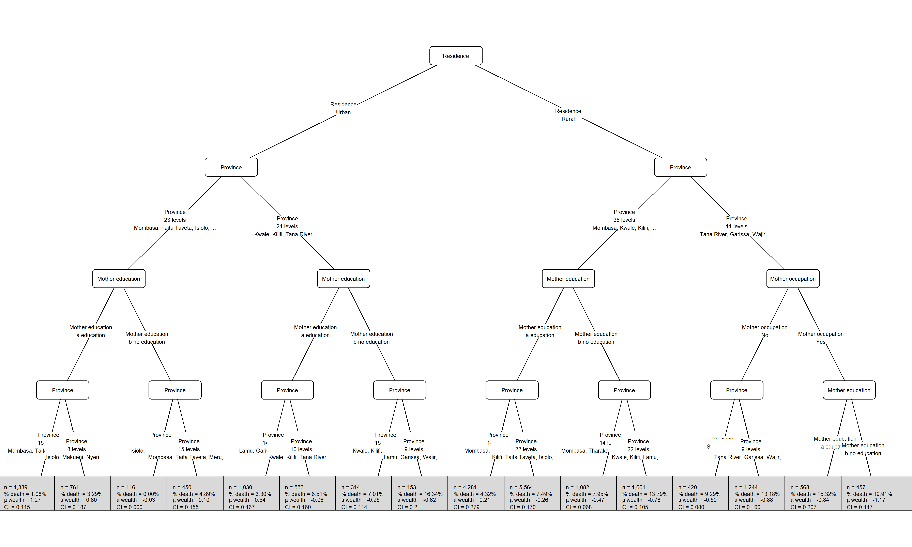
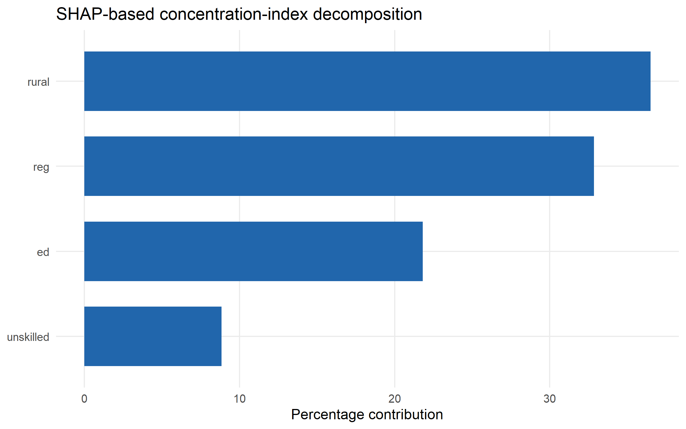
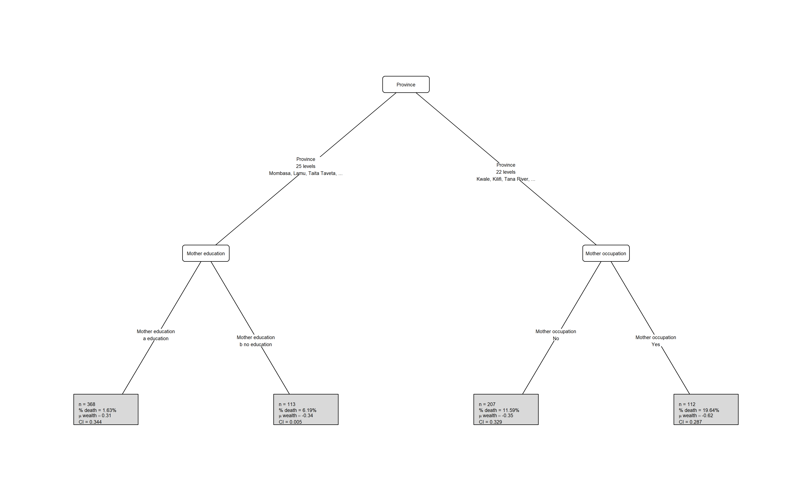
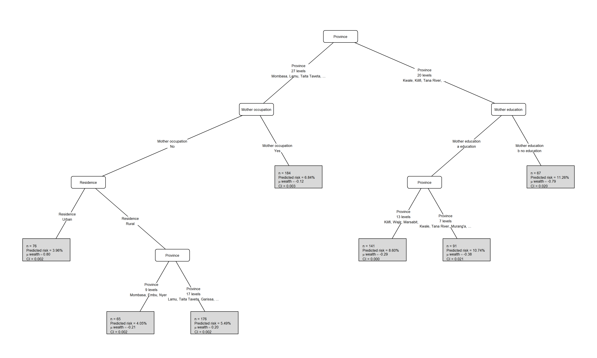

# ineqTrees

<!-- badges: start -->

[](https://github.com/m-mburu/ineqTrees/actions/workflows/R-CMD-check.yaml)

<!-- badges: end -->

`ineqTrees` provides tools for studying socioeconomic inequality in
health outcomes with tree-based models. The package includes weighted
rank and concentration-index utilities, inequality-aware split scoring,
and wrappers for fitting greedy concentration-index trees and forests.

## Installation

You can install the development version of ineqTrees like so:

``` r
remotes::install_github("m-mburu/ineqTrees")
```

## Fitting a tree

The example below fits an inequality-aware greedy tree on a sample from
the built-in `kenya` dataset. The response combines the ranking variable
(`wealth`) and the health outcome (`deadu5_num`), while the split
criterion is based on concentration-index reduction.

### load data and set seed for reproducibility

``` r
if (requireNamespace("pkgload", quietly = TRUE) && file.exists("DESCRIPTION")) {
  suppressMessages(pkgload::load_all(export_all = FALSE))
} else {
  library(ineqTrees)
}
load("data/kenya.rda")

set.seed(1)
```

### Fit tree

- This is a concentration-index tree, so the response is a two-column
  matrix of the ranking variable and the outcome. The `rank_name` and
  `outcome_name` arguments specify which columns of the data to use for
  those roles. The split criterion is based on concentration-index
  reduction, so the `control` argument specifies greedy controls rather
  than conditional-inference test controls.

``` r
fit_tree <- ctree_ci(
  formula = cbind(wealth, deadu5_num) ~ rural + ed + reg + unskilled,
  data = kenya,
  rank_name = "wealth",
  outcome_name = "deadu5_num",
  control = ci_tree_control(maxdepth = 4L)
)
```

``` r
fit_tree
#> 
#> Model formula:
#> cbind(wealth, deadu5_num) ~ rural + ed + reg + unskilled
#> 
#> Fitted party:
#> [1] root
#> |   [2] rural in Urban
#> |   |   [3] reg in Mombasa, Taita Taveta, Isiolo, Meru, Makueni, Nyeri, Kirinyaga, Kiambu, Trans Nzoia, Uasin Gishu, Nandi, Laikipia, Nakuru, Kajiado, Kericho, Bomet, Kakamega, Vihiga, Busia, Homa Bay, Migori, Kisii, Nairobi
#> |   |   |   [4] ed in a education
#> |   |   |   |   [5] reg in Mombasa, Taita Taveta, Meru, Kirinyaga, Kiambu, Trans Nzoia, Uasin Gishu, Nandi, Laikipia, Kajiado, Kericho, Bomet, Vihiga, Kisii, Nairobi: 0.011 (n = 1389, err = 14.8)
#> |   |   |   |   [6] reg in Isiolo, Makueni, Nyeri, Nakuru, Kakamega, Busia, Homa Bay, Migori: 0.033 (n = 761, err = 24.2)
#> |   |   |   [7] ed in b no education
#> |   |   |   |   [8] reg in Isiolo, Makueni, Nyeri, Kirinyaga, Uasin Gishu, Kajiado, Bomet, Vihiga: 0.000 (n = 116, err = 0.0)
#> |   |   |   |   [9] reg in Mombasa, Taita Taveta, Meru, Kiambu, Trans Nzoia, Nandi, Laikipia, Nakuru, Kericho, Kakamega, Busia, Homa Bay, Migori, Kisii, Nairobi: 0.049 (n = 450, err = 20.9)
#> |   |   [10] reg in Kwale, Kilifi, Tana River, Lamu, Garissa, Wajir, Mandera, Marsabit, Tharaka-Nithi, Embu, Kitui, Machakos, Nyandarua, Murang'a, Turkana, West Pokot, Samburu, Elgeyo-Marakwet, Baringo, Narok, Bungoma, Siaya, Kisumu, Nyamira
#> |   |   |   [11] ed in a education
#> |   |   |   |   [12] reg in Lamu, Garissa, Marsabit, Tharaka-Nithi, Kitui, Machakos, Nyandarua, Murang'a, West Pokot, Baringo, Narok, Bungoma, Kisumu, Nyamira: 0.033 (n = 1030, err = 32.9)
#> |   |   |   |   [13] reg in Kwale, Kilifi, Tana River, Wajir, Mandera, Embu, Turkana, Samburu, Elgeyo-Marakwet, Siaya: 0.065 (n = 553, err = 33.7)
#> |   |   |   [14] ed in b no education
#> |   |   |   |   [15] reg in Kwale, Kilifi, Tana River, Mandera, Tharaka-Nithi, Embu, Machakos, Nyandarua, Murang'a, Elgeyo-Marakwet, Baringo, Bungoma, Siaya, Kisumu, Nyamira: 0.070 (n = 314, err = 20.5)
#> |   |   |   |   [16] reg in Lamu, Garissa, Wajir, Marsabit, Kitui, Turkana, West Pokot, Samburu, Narok: 0.163 (n = 153, err = 20.9)
#> |   [17] rural in Rural
#> |   |   [18] reg in Mombasa, Kwale, Kilifi, Lamu, Taita Taveta, Isiolo, Meru, Tharaka-Nithi, Embu, Kitui, Machakos, Makueni, Nyandarua, Nyeri, Kirinyaga, Murang'a, Kiambu, Trans Nzoia, Uasin Gishu, Elgeyo-Marakwet, Nandi, Baringo, Laikipia, Nakuru, Narok, Kajiado, Kericho, Bomet, Kakamega, Vihiga, Bungoma, Busia, Kisumu, Kisii, Nyamira, Nairobi
#> |   |   |   [19] ed in a education
#> |   |   |   |   [20] reg in Mombasa, Kwale, Lamu, Machakos, Nyeri, Kirinyaga, Kiambu, Trans Nzoia, Elgeyo-Marakwet, Nandi, Nakuru, Vihiga, Nyamira, Nairobi: 0.043 (n = 4281, err = 177.0)
#> |   |   |   |   [21] reg in Kilifi, Taita Taveta, Isiolo, Meru, Tharaka-Nithi, Embu, Kitui, Makueni, Nyandarua, Murang'a, Uasin Gishu, Baringo, Laikipia, Narok, Kajiado, Kericho, Bomet, Kakamega, Bungoma, Busia, Kisumu, Kisii: 0.075 (n = 5564, err = 385.7)
#> |   |   |   [22] ed in b no education
#> |   |   |   |   [23] reg in Mombasa, Tharaka-Nithi, Nyandarua, Nyeri, Kirinyaga, Murang'a, Kiambu, Nandi, Laikipia, Narok, Bomet, Vihiga, Busia, Nairobi: 0.079 (n = 1082, err = 79.2)
#> |   |   |   |   [24] reg in Kwale, Kilifi, Lamu, Taita Taveta, Isiolo, Meru, Embu, Kitui, Machakos, Makueni, Trans Nzoia, Uasin Gishu, Elgeyo-Marakwet, Baringo, Nakuru, Kajiado, Kericho, Kakamega, Bungoma, Kisumu, Kisii, Nyamira: 0.138 (n = 1661, err = 197.4)
#> |   |   [25] reg in Tana River, Garissa, Wajir, Mandera, Marsabit, Turkana, West Pokot, Samburu, Siaya, Homa Bay, Migori
#> |   |   |   [26] unskilled in No
#> |   |   |   |   [27] reg in Siaya, Migori: 0.093 (n = 420, err = 35.4)
#> |   |   |   |   [28] reg in Tana River, Garissa, Wajir, Mandera, Marsabit, Turkana, West Pokot, Samburu, Homa Bay: 0.132 (n = 1244, err = 142.4)
#> |   |   |   [29] unskilled in Yes
#> |   |   |   |   [30] ed in a education: 0.153 (n = 568, err = 73.7)
#> |   |   |   |   [31] ed in b no education: 0.199 (n = 457, err = 72.9)
#> 
#> Number of inner nodes:    15
#> Number of terminal nodes: 16
```

``` r
readme_tree_plot(fit_tree, kenya, "deadu5_num")
```



## Fitting a forest

The forest interface uses the same response specification, but averages
predictions across many greedy concentration-index trees. The tuned
workflow later in the README uses the same model family with
cross-validation.

``` r
fit_forest <- cf_ci(
  formula = cbind(wealth, deadu5_num) ~ rural + ed + reg + unskilled,
  data = kenya,
  rank_name = "wealth",
  outcome_name = "deadu5_num",
  ntree = 10L,
  mtry = 1L,
  control = ci_tree_control(maxdepth = 5L)
)
```

## SHAP-based decomposition

- Approximate SHAP values for the fitted forest with
  `fastshap::explain()`, using a prediction wrapper that returns the
  predicted outcome for each observation.
- Decompose the concentration index of those predicted risks with
  `shap_conc_decomp()`.

``` r
set.seed(20260328)
shap_eval_n <- min(400L, nrow(kenya))
shap_rows <- sort(sample.int(nrow(kenya), shap_eval_n))
forest_X <- kenya[readme_predictors]
shap_X_eval <- forest_X[shap_rows, , drop = FALSE]
forest_pred_eval <- readme_forest_predict(fit_forest, shap_X_eval)
wealth_eval <- kenya$wealth[shap_rows]

forest_shap <- fastshap::explain(
  object = fit_forest,
  X = forest_X,
  pred_wrapper = readme_forest_predict,
  newdata = shap_X_eval,
  nsim = 64,
  adjust = TRUE
)

decomp <- shap_conc_decomp(
  shap = forest_shap,
  rank = wealth_eval,
  prediction = forest_pred_eval
)

shap_diagnostics <- as.data.frame(decomp$diagnostics)
shap_contrib_table <- as.data.frame(decomp$contributions)
shap_contrib_table <- shap_contrib_table[
  order(-shap_contrib_table$abs_contribution),
  ,
  drop = FALSE
]
```

``` r
knitr::kable(
  shap_diagnostics,
  digits = 3,
  caption = "SHAP decomposition diagnostics"
)
```

| n | mean_prediction | concentration_index | shap_sum | additivity_gap | centered_rank_sum | prediction_source |
|---:|---:|---:|---:|---:|---:|:---|
| 400 | 0.074 | -0.099 | -0.099 | 0 | 0 | prediction |

SHAP decomposition diagnostics

``` r
knitr::kable(
  shap_contrib_table,
  digits = 3,
  caption = "SHAP-based concentration-index contributions"
)
```

| feature   | D_k_SHAP | pct_contribution | abs_contribution |
|:----------|---------:|-----------------:|-----------------:|
| rural     |   -0.036 |           36.488 |            0.036 |
| reg       |   -0.033 |           32.850 |            0.033 |
| ed        |   -0.022 |           21.821 |            0.022 |
| unskilled |   -0.009 |            8.842 |            0.009 |

SHAP-based concentration-index contributions

``` r
library(ggplot2)
ggplot(
  shap_contrib_table,
  aes(
    x = stats::reorder(feature, pct_contribution),
    y = pct_contribution,
    fill = pct_contribution > 0
  )
) +
  geom_col(width = 0.7) +
  coord_flip() +
  scale_fill_manual(
    values = c("#2166ac", "#b2182b"),
    guide = "none"
  ) +
  labs(
    x = NULL,
    y = "Percentage contribution",
    title = "SHAP-based concentration-index decomposition"
  ) +
  theme_minimal(base_size = 12) +
  theme(panel.grid.minor = element_blank())
```



``` r
set.seed(20260507)
tuning_n <- min(800L, nrow(kenya))
tuning_rows <- sort(sample.int(nrow(kenya), tuning_n))
tuning_data <- kenya[tuning_rows, , drop = FALSE]
```

## Tune tree hyperparameters

The current model-selection workflow uses `ci_tree_control_grid()` to
define candidate greedy controls and `tune_ctree_ci()` to score them
with cross-validation. The concentration-index variant is tuned
alongside the tree controls by passing several values to `type`.

``` r
tree_tune_grid <- ci_tree_control_grid(
  minsplit = c(150L, 250L),
  minbucket = c(60L, 100L),
  maxdepth = 2L:5L
)
```

``` r
tree_tuning <- tune_ctree_ci(
  formula = cbind(wealth, deadu5_num) ~ rural + ed + reg + unskilled,
  data = tuning_data,
  rank_name = "wealth",
  outcome_name = "deadu5_num",
  type = c("CI", "CIg", "CIc"),
  control_grid = tree_tune_grid,
  v = 3L,
  strata = "deadu5_num",
  seed = 20260507,
  metric = "validation_gain",
  refit = TRUE
)
```

``` r
tree_tuning_table <- readme_tuning_table(
  tree_tuning$summary,
  columns = c(
    "type",
    "minsplit",
    "minbucket",
    "maxdepth",
    "mean_score",
    "sd_score",
    "mean_terminal_nodes"
  ),
  labels = c(
    "type",
    "minsplit",
    "minbucket",
    "maxdepth",
    "mean_validation_gain",
    "sd_validation_gain",
    "mean_terminal_nodes"
  )
)

knitr::kable(
  tree_tuning_table,
  digits = 3,
  caption = "Cross-validated greedy tree tuning results"
)
```

| type | minsplit | minbucket | maxdepth | mean_validation_gain | sd_validation_gain | mean_terminal_nodes |
|:---|---:|---:|---:|---:|---:|---:|
| CIc | 150 | 100 | 3 | 0.012 | 0.012 | 3.333 |
| CIc | 150 | 100 | 4 | 0.012 | 0.012 | 3.333 |
| CIc | 150 | 100 | 5 | 0.012 | 0.012 | 3.333 |
| CIc | 150 | 100 | 2 | 0.012 | 0.013 | 3.000 |
| CIc | 250 | 100 | 2 | 0.012 | 0.013 | 3.000 |
| CIc | 250 | 100 | 3 | 0.012 | 0.013 | 3.000 |
| CIc | 250 | 100 | 4 | 0.012 | 0.013 | 3.000 |
| CIc | 250 | 100 | 5 | 0.012 | 0.013 | 3.000 |
| CIc | 250 | 60 | 2 | 0.011 | 0.015 | 3.000 |
| CIc | 150 | 60 | 2 | 0.008 | 0.017 | 3.333 |
| CIg | 150 | 100 | 3 | 0.003 | 0.003 | 3.333 |
| CIg | 150 | 100 | 4 | 0.003 | 0.003 | 3.333 |
| CIg | 150 | 100 | 5 | 0.003 | 0.003 | 3.333 |
| CIg | 150 | 100 | 2 | 0.003 | 0.003 | 3.000 |
| CIg | 250 | 100 | 2 | 0.003 | 0.003 | 3.000 |
| CIg | 250 | 100 | 3 | 0.003 | 0.003 | 3.000 |
| CIg | 250 | 100 | 4 | 0.003 | 0.003 | 3.000 |
| CIg | 250 | 100 | 5 | 0.003 | 0.003 | 3.000 |
| CIg | 250 | 60 | 2 | 0.003 | 0.004 | 3.000 |
| CIc | 250 | 60 | 3 | 0.002 | 0.026 | 3.667 |
| CIc | 250 | 60 | 4 | 0.002 | 0.026 | 3.667 |
| CIc | 250 | 60 | 5 | 0.002 | 0.026 | 3.667 |
| CIg | 150 | 60 | 2 | 0.002 | 0.004 | 3.333 |
| CIg | 250 | 60 | 3 | 0.001 | 0.006 | 3.667 |
| CIg | 250 | 60 | 4 | 0.001 | 0.006 | 3.667 |
| CIg | 250 | 60 | 5 | 0.001 | 0.006 | 3.667 |
| CIg | 150 | 60 | 3 | 0.000 | 0.007 | 4.000 |
| CIg | 150 | 60 | 4 | 0.000 | 0.007 | 4.000 |
| CIg | 150 | 60 | 5 | 0.000 | 0.007 | 4.000 |
| CIc | 150 | 60 | 3 | 0.000 | 0.026 | 4.000 |
| CIc | 150 | 60 | 4 | 0.000 | 0.026 | 4.000 |
| CIc | 150 | 60 | 5 | 0.000 | 0.026 | 4.000 |
| CI | 150 | 60 | 3 | -0.010 | 0.041 | 3.667 |
| CI | 150 | 60 | 4 | -0.010 | 0.041 | 3.667 |
| CI | 150 | 60 | 5 | -0.010 | 0.041 | 3.667 |
| CI | 150 | 60 | 2 | -0.015 | 0.042 | 3.000 |
| CI | 250 | 60 | 2 | -0.020 | 0.032 | 2.333 |
| CI | 250 | 100 | 2 | -0.020 | 0.032 | 2.333 |
| CI | 250 | 60 | 3 | -0.020 | 0.032 | 2.333 |
| CI | 250 | 100 | 3 | -0.020 | 0.032 | 2.333 |
| CI | 250 | 60 | 4 | -0.020 | 0.032 | 2.333 |
| CI | 250 | 100 | 4 | -0.020 | 0.032 | 2.333 |
| CI | 250 | 60 | 5 | -0.020 | 0.032 | 2.333 |
| CI | 250 | 100 | 5 | -0.020 | 0.032 | 2.333 |
| CI | 150 | 100 | 2 | -0.031 | 0.044 | 2.667 |
| CI | 150 | 100 | 3 | -0.031 | 0.044 | 2.667 |
| CI | 150 | 100 | 4 | -0.031 | 0.044 | 2.667 |
| CI | 150 | 100 | 5 | -0.031 | 0.044 | 2.667 |

Cross-validated greedy tree tuning results

``` r
readme_tree_plot(
  fit = tree_tuning$best_fit,
  data = tuning_data,
  outcome_name = "deadu5_num"
)
```



## Tune forest hyperparameters

For forests, `tune_cf_ci()` uses the same greedy controls and adds
`ntree` when that column is present in the tuning grid. Each candidate
forest is summarized by a surrogate greedy CI tree, and the grid is
ranked by held-out CI validation gain from that surrogate.

``` r
forest_tune_grid <- ci_tree_control_grid(
  minsplit = 150L,
  minbucket = 60L,
  maxdepth = c(3L:6L),
  mtry = c(1L, 2L),
  ntree = c(10L, 50L, 100L)
)
```

``` r
forest_tuning <- tune_cf_ci(
  formula = cbind(wealth, deadu5_num) ~ rural + ed + reg + unskilled,
  data = tuning_data,
  rank_name = "wealth",
  outcome_name = "deadu5_num",
  type = c("CI", "CIg", "CIc"),
  control_grid = forest_tune_grid,
  v = 3L,
  strata = "deadu5_num",
  seed = 20260508,
  prediction_name = "forest_risk",
  refit = TRUE
)
```

``` r
forest_tuning_table <- readme_tuning_table(
  forest_tuning$summary,
  columns = c(
    "type",
    "ntree",
    "mtry",
    "maxdepth",
    "mean_score",
    "sd_score",
    "mean_terminal_nodes"
  ),
  labels = c(
    "type",
    "ntree",
    "mtry",
    "maxdepth",
    "mean_validation_gain",
    "sd_validation_gain",
    "mean_terminal_nodes"
  )
)

knitr::kable(
  forest_tuning_table,
  digits = 3,
  caption = "Cross-validated greedy forest tuning results ranked by validation gain"
)
```

| type | ntree | mtry | maxdepth | mean_validation_gain | sd_validation_gain | mean_terminal_nodes |
|:---|---:|---:|---:|---:|---:|---:|
| CI | 10 | 1 | 4 | 0.068 | 0.010 | 3.667 |
| CI | 50 | 2 | 5 | 0.060 | 0.058 | 4.000 |
| CI | 10 | 1 | 6 | 0.054 | 0.010 | 4.000 |
| CI | 10 | 2 | 4 | 0.053 | 0.087 | 3.333 |
| CI | 50 | 1 | 3 | 0.042 | 0.056 | 4.000 |
| CI | 100 | 1 | 3 | 0.034 | 0.075 | 4.000 |
| CI | 10 | 1 | 5 | 0.033 | 0.057 | 3.667 |
| CI | 50 | 2 | 4 | 0.033 | 0.007 | 4.000 |
| CI | 100 | 2 | 6 | 0.033 | 0.022 | 3.000 |
| CI | 10 | 2 | 6 | 0.032 | 0.046 | 3.667 |
| CI | 50 | 2 | 3 | 0.030 | 0.018 | 3.667 |
| CI | 50 | 2 | 6 | 0.026 | 0.019 | 3.333 |
| CI | 100 | 2 | 5 | 0.026 | 0.036 | 4.000 |
| CI | 50 | 1 | 5 | 0.023 | 0.023 | 4.333 |
| CI | 100 | 1 | 5 | 0.023 | 0.023 | 4.000 |
| CIc | 100 | 1 | 6 | 0.019 | 0.010 | 5.000 |
| CI | 100 | 2 | 3 | 0.019 | 0.019 | 3.667 |
| CI | 10 | 2 | 5 | 0.018 | 0.035 | 3.667 |
| CIc | 50 | 1 | 6 | 0.017 | 0.009 | 4.333 |
| CIc | 100 | 2 | 3 | 0.017 | 0.007 | 4.333 |
| CIc | 10 | 2 | 4 | 0.016 | 0.010 | 4.333 |
| CI | 100 | 1 | 4 | 0.016 | 0.059 | 4.000 |
| CIc | 50 | 2 | 3 | 0.015 | 0.007 | 4.333 |
| CIc | 100 | 2 | 6 | 0.015 | 0.008 | 4.667 |
| CIc | 50 | 1 | 4 | 0.015 | 0.011 | 5.333 |
| CIc | 50 | 2 | 4 | 0.015 | 0.004 | 4.333 |
| CI | 50 | 1 | 4 | 0.013 | 0.032 | 3.667 |
| CIc | 100 | 2 | 4 | 0.013 | 0.010 | 5.000 |
| CIc | 100 | 2 | 5 | 0.013 | 0.006 | 4.000 |
| CIc | 100 | 1 | 3 | 0.012 | 0.009 | 4.333 |
| CIc | 50 | 1 | 3 | 0.012 | 0.005 | 4.667 |
| CIc | 50 | 1 | 5 | 0.011 | 0.014 | 5.000 |
| CIc | 50 | 2 | 6 | 0.011 | 0.015 | 4.667 |
| CIc | 10 | 2 | 3 | 0.011 | 0.017 | 4.333 |
| CI | 100 | 1 | 6 | 0.010 | 0.025 | 4.667 |
| CI | 100 | 2 | 4 | 0.010 | 0.018 | 4.000 |
| CIc | 10 | 1 | 6 | 0.010 | 0.008 | 4.333 |
| CIc | 10 | 2 | 6 | 0.008 | 0.007 | 4.333 |
| CIg | 10 | 1 | 6 | 0.006 | 0.003 | 5.667 |
| CIc | 100 | 1 | 4 | 0.006 | 0.016 | 4.667 |
| CIc | 50 | 2 | 5 | 0.006 | 0.025 | 5.333 |
| CIc | 10 | 1 | 3 | 0.005 | 0.011 | 4.667 |
| CIg | 100 | 1 | 3 | 0.004 | 0.001 | 4.333 |
| CIc | 100 | 1 | 5 | 0.004 | 0.019 | 4.667 |
| CIg | 100 | 2 | 3 | 0.004 | 0.001 | 4.667 |
| CIg | 10 | 1 | 5 | 0.004 | 0.003 | 4.333 |
| CIg | 50 | 2 | 6 | 0.004 | 0.001 | 4.333 |
| CIg | 10 | 1 | 3 | 0.004 | 0.001 | 4.333 |
| CIg | 100 | 2 | 4 | 0.003 | 0.000 | 4.667 |
| CIg | 50 | 1 | 4 | 0.003 | 0.002 | 5.333 |
| CIg | 10 | 2 | 4 | 0.003 | 0.003 | 4.667 |
| CIg | 50 | 2 | 4 | 0.003 | 0.002 | 4.000 |
| CIg | 50 | 1 | 6 | 0.003 | 0.004 | 5.333 |
| CIc | 10 | 2 | 5 | 0.003 | 0.012 | 4.333 |
| CIc | 10 | 1 | 4 | 0.002 | 0.017 | 4.667 |
| CI | 10 | 1 | 3 | 0.002 | 0.072 | 4.333 |
| CIg | 10 | 2 | 5 | 0.002 | 0.002 | 4.667 |
| CIg | 100 | 1 | 5 | 0.002 | 0.003 | 5.333 |
| CIg | 10 | 2 | 6 | 0.002 | 0.001 | 4.333 |
| CIg | 100 | 2 | 5 | 0.002 | 0.001 | 5.000 |
| CIg | 100 | 1 | 6 | 0.002 | 0.004 | 5.333 |
| CIg | 100 | 2 | 6 | 0.002 | 0.004 | 5.333 |
| CIg | 50 | 1 | 3 | 0.002 | 0.003 | 4.667 |
| CIg | 10 | 1 | 4 | 0.002 | 0.003 | 4.667 |
| CIg | 10 | 2 | 3 | 0.002 | 0.002 | 4.667 |
| CIg | 50 | 2 | 5 | 0.002 | 0.002 | 4.667 |
| CIg | 50 | 2 | 3 | 0.001 | 0.003 | 4.333 |
| CIg | 100 | 1 | 4 | 0.001 | 0.002 | 5.333 |
| CIg | 50 | 1 | 5 | 0.001 | 0.003 | 5.333 |
| CIc | 10 | 1 | 5 | -0.001 | 0.016 | 4.333 |
| CI | 10 | 2 | 3 | -0.014 | 0.039 | 4.000 |
| CI | 50 | 1 | 6 | -0.016 | 0.022 | 4.667 |

Cross-validated greedy forest tuning results ranked by validation gain

``` r
best_tuned_forest <- forest_tuning$best_fit
forest_surrogate_data <- forest_tuning$best_surrogate_data
```

``` r
forest_surrogate_fit <- forest_tuning$best_surrogate
```

``` r
readme_tree_plot(
  fit = forest_surrogate_fit,
  data = forest_surrogate_data,
  outcome_name = "forest_risk",
  outcome_label = "Predicted risk"
)
```


